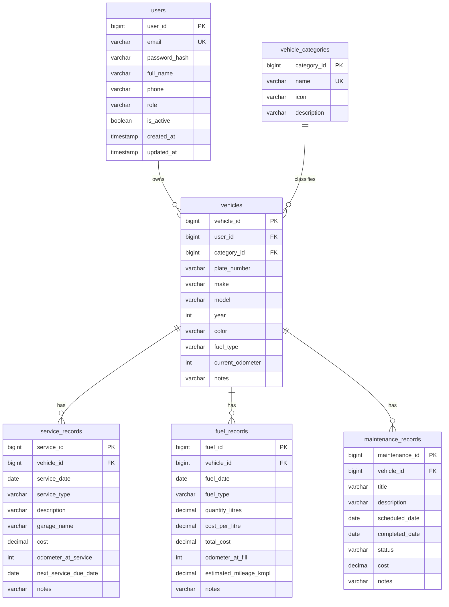

# MyGarage — Vehicle Service History, Fuel Record & Maintenance Tracking Platform

[](https://www.oracle.com/java/)
[](https://spring.io/projects/spring-boot)
[](https://spring.io/projects/spring-security)
[](https://www.mysql.com/)
[](https://www.thymeleaf.org/)
[](https://getbootstrap.com/)
[]()

> **Final Year Main Project (2026–2027)**  
> **System ID:** APPJFS19  
> **Domain:** Full Stack Java Engineering & Enterprise Systems

---

## 1. Executive Summary

**MyGarage** is an enterprise-grade vehicle lifecycle management platform designed to replace scattered paper bills, phone notes, and forgotten maintenance dates with a centralized digital logbook. 

Built using **Java 21 LTS**, **Spring Boot 3.3.5**, **Spring Data JPA / Hibernate ORM**, **Spring Security 6.x**, **MySQL 8.0**, and **Thymeleaf 3.1 + Bootstrap 5**, MyGarage provides individual vehicle owners with real-time operational analytics, fuel mileage calculations, scheduled maintenance urgency tracking, official vehicle resale dossiers, and RFC 4180 CSV spreadsheet exports while enforcing two-tier ownership isolation and administrative governance.

---

## 2. Key Architecture & Features

### 👤 Normal User Features
- **Garage Management:** Add, edit, view, and delete multiple vehicles (cars, motorcycles, scooters, trucks, EVs) with license plate uniqueness and category classification.
- **Vehicle Resale Dossier & Service Certificate:** Print-ready, certified life-history dossiers (`/vehicles/{id}/report`) with official verification seal, lifetime financial summaries, and chronologically verified ledgers for vehicle resale, insurance handoff, and mechanic audits.
- **Multi-Format Data Export:** RFC 4180 compliant CSV exports for Services, Fuel Logs, Maintenance Tasks, Unified Master History, and Complete User Garage Portfolios.
- **Global Record Views:** Dedicated cross-vehicle central feeds for All Services (with search & cost tallies), All Fuel Logs (with volume, spend, and avg mileage), and All Maintenance Tasks (with urgency filters and one-click completion).
- **Service History:** Log maintenance visits with garage names, parts replaced, costs, and next service due dates.
- **Fuel Mileage Tracking:** Automatically calculates fuel economy ($\text{km/L}$) between consecutive fill-ups based on odometer progression and volume.
- **Dynamic Maintenance Alerts:** Automated urgency categorization:
  - `OVERDUE`: Scheduled date is in the past and task is pending.
  - `DUE_TODAY`: Scheduled date matches current system date.
  - `UPCOMING`: Scheduled date is in the future.
  - `COMPLETED`: Marked done with recorded completion date.
- **Garage Financial Summary:** Real-time calculation of fuel spend, service expenses, scheduled maintenance costs, and average mileage across all owned vehicles.
- **Vehicle Timeline:** Chronologically ordered timeline showing full service, fueling, and maintenance milestones per vehicle.
- **Profile Management:** Update personal information, phone number, and securely change passwords with current-password verification.

### 🛡️ System Administrator Features
- **System Dashboard & Record Monitoring:** High-level platform counters (total registered users, total vehicles, total service records, total fuel logs, total maintenance tasks) and category distribution metrics without exposing private user record contents.
- **User Governance:** Search and filter registered users by name or email; toggle account active/disabled status.
- **Primary Admin Inviolability:** Hard security guard preventing the accidental or malicious deactivation/deletion of the primary administrator account.
- **Category Management:** Manage standard vehicle categories (icon, name, description) with referential integrity protection (deletion blocked if vehicles are assigned).
- **Strict Privacy Isolation:** Administrators have no backdoor into individual user garages, dossiers, or logs.

---

## 3. Technology Stack

| Layer | Component / Tool | Version |
|---|---|---|
| **Language** | Java SE (LTS) | **21.0.7 (Oracle JDK)** |
| **Backend Framework** | Spring Boot | **3.3.5** |
| **Security** | Spring Security (BCrypt Hashing + Form Session) | **6.3.4** |
| **Data Persistence** | Spring Data JPA / Hibernate ORM | **6.5.3.Final** |
| **Database** | MySQL Server Community Edition | **8.0.43** |
| **Template Engine** | Thymeleaf + Extras Spring Security 6 | **3.1.2** |
| **Frontend Styling** | Bootstrap + Bootstrap Icons | **5.3.2 / 1.11.3** |
| **Build Tool** | Apache Maven | **3.9.10** |
| **Testing** | JUnit 5 Jupiter, MockMvc, AssertJ | **5.10.3** |

---

## 4. Database Schema (6 Core Entities)



---

## 5. Getting Started & Installation

### Prerequisites
1. **JDK 21** installed and configured in `PATH` (`java -version`).
2. **Apache Maven 3.9+** installed (`mvn -version`).
3. **MySQL Server 8.0+** running on `localhost:3306`.

### Quick Setup (Automated Batch Scripts)

1. **Setup Database:**
   ```cmd
   scripts\setup-db.bat
   ```
2. **Start Application:**
   ```cmd
   scripts\start.bat
   ```
3. **Run Health Check:**
   ```cmd
   scripts\health-check.bat
   ```
4. **Run Full Test Suite:**
   ```cmd
   scripts\run-tests.bat
   ```

### Default Credentials
| Role | Email | Password |
|---|---|---|
| **System Administrator** | `admin@mygarage.com` | `Admin@123` |
| **Normal User** | Self-register at `/register` | User choice (min 6 chars) |

---

## 6. Comprehensive Verification Summary

- **Total Automated Test Cases:** **218**
- **Test Results:** **218 Passed, 0 Failed, 0 Errors, 0 Skipped**
- **Full Regression Status:** **`BUILD SUCCESS`**

```
[INFO] Results:
[INFO] 
[INFO] Tests run: 218, Failures: 0, Errors: 0, Skipped: 0
[INFO] 
[INFO] ------------------------------------------------------------------------
[INFO] BUILD SUCCESS
[INFO] ------------------------------------------------------------------------
```

---

## 7. Project Documentation

- [`docs/REQUIREMENTS.md`](docs/REQUIREMENTS.md) — Functional and Non-Functional Requirements Specification
- [`docs/DATABASE_DESIGN.md`](docs/DATABASE_DESIGN.md) — ERD, Data Dictionary, Cascade and Index Rules
- [`docs/SECURITY_DESIGN.md`](docs/SECURITY_DESIGN.md) — Spring Security Matcher Ordering, RBAC & CSRF Specification
- [`docs/API_DOCUMENTATION.md`](docs/API_DOCUMENTATION.md) — REST API Endpoints & Request/Response Contracts
- [`docs/TESTING.md`](docs/TESTING.md) — Testing Strategy, Automated Test Suites & Regression Verification
- [`docs/STUDENT_GUIDE_TANGLISH.md`](docs/STUDENT_GUIDE_TANGLISH.md) — Viva Preparation Guide in Tanglish
- [`FINAL_STATUS.md`](FINAL_STATUS.md) — Comprehensive Project Sign-Off Report

---

**MyGarage © 2026–2027 | APPJFS19 | Final Year Main Project**