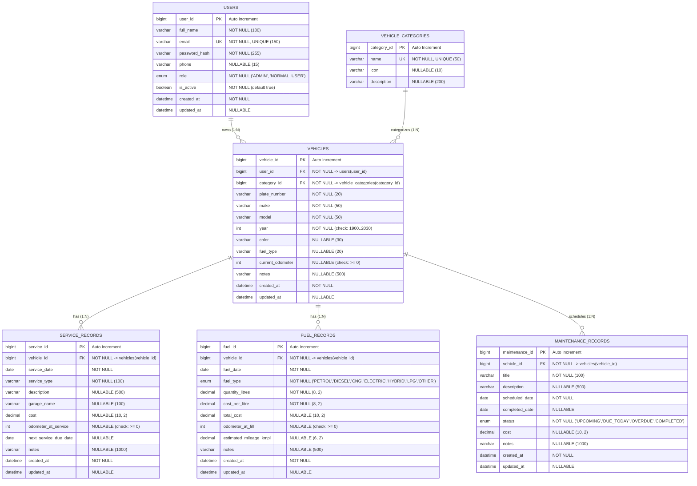

# DATABASE DESIGN DOCUMENTATION — MyGarage (APPJFS19)

**Project Name:** MyGarage — A Vehicle Service History, Fuel Record and Maintenance Tracking Platform  
**System ID:** APPJFS19  
**Database Engine:** MySQL Community Server 8.0.43  
**Database Name:** `mygarage_db`  
**ORM / Persistence:** Hibernate 6.5.3 / Spring Data JPA  
**Character Set / Collation:** `utf8mb4` / `utf8mb4_unicode_ci`  
**Last Verified:** Milestone 2 (M2) — 2026-09-03

---

## 1. Entity-Relationship Diagram (ERD)

---

## 2. Table Specifications & Data Dictionary

### Table 1: `users`
Represents application accounts (Standard Vehicle Owners and System Administrators).

| Column | Data Type | Nullable | Constraints / Index | Description |
|---|---|---|---|---|
| `user_id` | `BIGINT` | NO | `PRIMARY KEY`, `AUTO_INCREMENT` | Unique user identifier |
| `full_name` | `VARCHAR(100)` | NO | `@NotBlank`, `@Size(2..100)` | Full name of the user |
| `email` | `VARCHAR(150)` | NO | `UNIQUE (uk_users_email)`, `INDEX (idx_users_email)` | Login email (case-insensitive in queries) |
| `password_hash` | `VARCHAR(255)` | NO | BCrypt encoded (strength 10) | Hashed password (never plaintext) |
| `phone` | `VARCHAR(15)` | YES | Pattern: `^[0-9]{10}$` | 10-digit mobile number |
| `role` | `ENUM('NORMAL_USER','ADMIN')` | NO | `INDEX (idx_users_role)` | Authorization role |
| `is_active` | `BOOLEAN` / `BIT(1)` | NO | Default: `true` | Account status (toggleable by Admin) |
| `created_at` | `DATETIME(6)` | NO | Set in `@PrePersist` | Timestamp when user registered |
| `updated_at` | `DATETIME(6)` | YES | Set in `@PreUpdate` | Timestamp of last profile change |

---

### Table 2: `vehicle_categories`
Classification for registered vehicles (managed by Admin).

| Column | Data Type | Nullable | Constraints / Index | Description |
|---|---|---|---|---|
| `category_id` | `BIGINT` | NO | `PRIMARY KEY`, `AUTO_INCREMENT` | Unique category identifier |
| `name` | `VARCHAR(50)` | NO | `UNIQUE (uk_categories_name)` | Name (Sedan, SUV, Hatchback, Motorcycle, etc.) |
| `icon` | `VARCHAR(10)` | YES | Unicode / Emoji representation | Visual representation (e.g. 🚗, 🏍️) |
| `description` | `VARCHAR(200)` | YES | Max length 200 | Description of category |

**Referential Rule:** A category that has vehicles assigned to it **cannot** be deleted (`VehicleCategoryService.delete()` throws `IllegalArgumentException` after verifying vehicle count).

---

### Table 3: `vehicles`
Represents vehicles owned by users.

| Column | Data Type | Nullable | Constraints / Index | Description |
|---|---|---|---|---|
| `vehicle_id` | `BIGINT` | NO | `PRIMARY KEY`, `AUTO_INCREMENT` | Unique vehicle identifier |
| `user_id` | `BIGINT` | NO | `FOREIGN KEY -> users(user_id)`, `INDEX (idx_vehicles_user_id)` | Owning user |
| `category_id` | `BIGINT` | NO | `FOREIGN KEY -> vehicle_categories(category_id)`, `INDEX (idx_vehicles_category_id)` | Classification |
| `plate_number` | `VARCHAR(20)` | NO | `INDEX (idx_vehicles_plate)` | License plate number |
| `make` | `VARCHAR(50)` | NO | `@NotBlank` | Manufacturer (e.g. Honda, Hyundai) |
| `model` | `VARCHAR(50)` | NO | `@NotBlank` | Model (e.g. City, Creta) |
| `year` | `INT` | NO | Check: `year BETWEEN 1900 AND 2030` | Manufacturing year |
| `color` | `VARCHAR(30)` | YES | Max 30 chars | Vehicle color |
| `fuel_type` | `VARCHAR(20)` | YES | Max 20 chars | Primary fuel type |
| `current_odometer` | `INT` | YES | Check: `current_odometer >= 0` | Current distance reading in km |
| `notes` | `VARCHAR(500)` | YES | Max 500 chars | Owner notes |
| `created_at` | `DATETIME(6)` | NO | Set in `@PrePersist` | Record creation timestamp |
| `updated_at` | `DATETIME(6)` | YES | Set in `@PreUpdate` | Record update timestamp |

**Unique Constraint:** Composite key `UNIQUE (user_id, plate_number)` named `uk_vehicle_user_plate` guarantees plate numbers are unique per user garage.

---

### Table 4: `service_records`
Logs maintenance and repairs performed at garages.

| Column | Data Type | Nullable | Constraints / Index | Description |
|---|---|---|---|---|
| `service_id` | `BIGINT` | NO | `PRIMARY KEY`, `AUTO_INCREMENT` | Unique service record identifier |
| `vehicle_id` | `BIGINT` | NO | `FOREIGN KEY -> vehicles(vehicle_id)`, `INDEX (idx_service_vehicle_id)` | Target vehicle |
| `service_date` | `DATE` | NO | `INDEX (idx_service_date)` | Date service was performed |
| `service_type` | `VARCHAR(100)` | NO | `@NotBlank` | Type (e.g. Oil Change, Brake Inspection) |
| `description` | `VARCHAR(500)` | YES | Max 500 chars | Work summary |
| `garage_name` | `VARCHAR(100)` | YES | Max 100 chars | Name of garage or mechanic |
| `cost` | `DECIMAL(10,2)` | YES | Check: `cost >= 0.00` | Monetary cost in INR |
| `odometer_at_service` | `INT` | YES | Check: `odometer_at_service >= 0` | Odometer reading during service |
| `next_service_due_date`| `DATE` | YES | Next reminder date | Follow-up target date |
| `notes` | `VARCHAR(1000)`| YES | Max 1000 chars | Additional observations |
| `created_at` | `DATETIME(6)` | NO | Set in `@PrePersist` | Creation timestamp |
| `updated_at` | `DATETIME(6)` | YES | Set in `@PreUpdate` | Modification timestamp |

---

### Table 5: `fuel_records`
Logs fuel fill-ups and computes estimated mileage.

| Column | Data Type | Nullable | Constraints / Index | Description |
|---|---|---|---|---|
| `fuel_id` | `BIGINT` | NO | `PRIMARY KEY`, `AUTO_INCREMENT` | Unique fuel record identifier |
| `vehicle_id` | `BIGINT` | NO | `FOREIGN KEY -> vehicles(vehicle_id)`, `INDEX (idx_fuel_vehicle_id)` | Target vehicle |
| `fuel_date` | `DATE` | NO | `INDEX (idx_fuel_date)` | Date of fill-up |
| `fuel_type` | `ENUM(...)` | NO | `EnumType.STRING` (PETROL, DIESEL, CNG, etc.) | Fuel category |
| `quantity_litres` | `DECIMAL(8,2)`| NO | Min `0.1` | Fuel quantity in litres |
| `cost_per_litre` | `DECIMAL(8,2)`| NO | Min `0.01` | Rate per litre in INR |
| `total_cost` | `DECIMAL(10,2)`| YES | Auto-computed: `quantity * cost_per_litre` | Total fill-up cost in INR |
| `odometer_at_fill` | `INT` | YES | Check: `odometer_at_fill >= 0` | Odometer reading at fill station |
| `estimated_mileage_kmpl`| `DECIMAL(6,2)`| YES | Auto-calculated | Estimated mileage in km/L |
| `notes` | `VARCHAR(500)` | YES | Max 500 chars | Fill notes |
| `created_at` | `DATETIME(6)` | NO | Set in `@PrePersist` | Creation timestamp |
| `updated_at` | `DATETIME(6)` | YES | Set in `@PreUpdate` | Modification timestamp |

---

### Table 6: `maintenance_records`
Schedules proactive vehicle maintenance tasks and tracks completion.

| Column | Data Type | Nullable | Constraints / Index | Description |
|---|---|---|---|---|
| `maintenance_id` | `BIGINT` | NO | `PRIMARY KEY`, `AUTO_INCREMENT` | Unique maintenance identifier |
| `vehicle_id` | `BIGINT` | NO | `FOREIGN KEY -> vehicles(vehicle_id)`, `INDEX (idx_maint_vehicle_id)` | Target vehicle |
| `title` | `VARCHAR(100)` | NO | `@NotBlank` | Maintenance task title |
| `description` | `VARCHAR(500)` | YES | Max 500 chars | Task description |
| `scheduled_date` | `DATE` | NO | `INDEX (idx_maint_scheduled)` | Planned target date |
| `completed_date` | `DATE` | YES | Nullable | Actual completion date |
| `status` | `ENUM(...)` | NO | `INDEX (idx_maint_status)` | Status: UPCOMING, DUE_TODAY, OVERDUE, COMPLETED |
| `cost` | `DECIMAL(10,2)` | YES | Check: `cost >= 0.00` | Cost incurred |
| `notes` | `VARCHAR(1000)`| YES | Max 1000 chars | Maintenance notes |
| `created_at` | `DATETIME(6)` | NO | Set in `@PrePersist` | Creation timestamp |
| `updated_at` | `DATETIME(6)` | YES | Set in `@PreUpdate` | Modification timestamp |

---

## 3. Data Integrity & Ownership Protection Rules

### 1. Hierarchical Data Ownership
Every entity in the domain strictly belongs to a single `User`:
$$\text{User} \xrightarrow{1:N} \text{Vehicle} \xrightarrow{1:N} \{\text{ServiceRecord}, \text{FuelRecord}, \text{MaintenanceRecord}\}$$

Repository queries systematically enforce this at the database level:
- `VehicleRepository.findByVehicleIdAndUserUserId(vehicleId, userId)`
- `ServiceRecordRepository.findByServiceIdAndVehicleUserUserId(serviceId, userId)`
- `FuelRecordRepository.findByFuelIdAndVehicleUserUserId(fuelId, userId)`
- `MaintenanceRecordRepository.findByMaintenanceIdAndVehicleUserUserId(maintenanceId, userId)`

A user cannot access, modify, or delete another user's records under any circumstances.

### 2. Referential Integrity & Cascade Semantics
- **Vehicle Deletion:** When a vehicle is removed, `CascadeType.ALL` and `orphanRemoval = true` ensure that all child `service_records`, `fuel_records`, and `maintenance_records` are deleted concurrently. No orphan records can exist.
- **Category Deletion:** A category with assigned vehicles **cannot** be deleted (`countByCategoryCategoryId > 0` aborts with an error). Categories have no cascade delete to vehicles.
- **User Management:** Users are not deleted outright; their `is_active` status is toggled by administrators to preserve data auditing integrity.

### 3. Monetary Precision & Rounding
All currency columns (`cost`, `cost_per_litre`, `total_cost`) use `DECIMAL(10, 2)` or `DECIMAL(8, 2)` with `java.math.BigDecimal` to eliminate IEEE 754 floating-point rounding errors.

---

## 4. Default Seed Configuration (`data.sql`)

1. **System Administrator:**
   - Email: `admin@mygarage.com`
   - Password: `Admin@123`
   - BCrypt Hash (strength 10): `$2a$10$gTZWG2345TLShuH70fsN3OL/e4/dliZSJggoEfl6i3KMK5YobVm9u`
   - Role: `ADMIN`
   - Self-registration is strictly prohibited for the `ADMIN` role.

2. **Standard Vehicle Categories:**
   - 🚗 Sedan
   - 🚙 SUV
   - 🚘 Hatchback
   - 🏍️ Motorcycle
   - 🛵 Scooter
   - 🚐 MUV / Van
   - 🚚 Truck
   - 🚗 Other